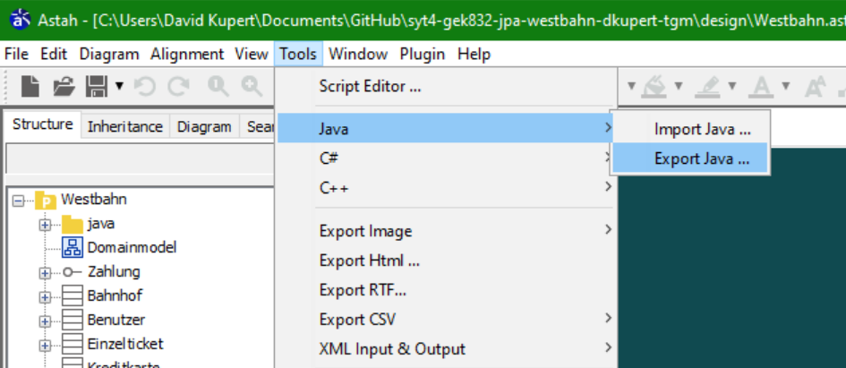
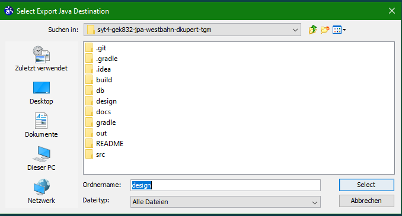

# Astah: Klassen aus Datei generieren

Wenn man im besitzt eines bereits erstellen `.asta`-Files ist kann man aus diesem auch JAVA-Klassen direkt generieren lassen. Hier zu muss man zum Reiter `Tools --> Java --> Export Java` gehen. Danach wird man gefragt, wo die Dateien abgespeichert werden sollen. [1]

## Achtung

Astha kann zwar viel, aber es kann zu Fehler kommen. Deshalb ist zu empfehlen, dass sich der Benutzer die  generierten JAVA-Klassen nochmal anschaut um sicherzugehen, dass es zu keinen ungewünschten Verhalten kommt.

## Quellen

[1] : "ASTA JAVA Guide" [online](https://astah.net/support/astah-pro/user-guide/java/) | zuletzt besucht 01.04.2020