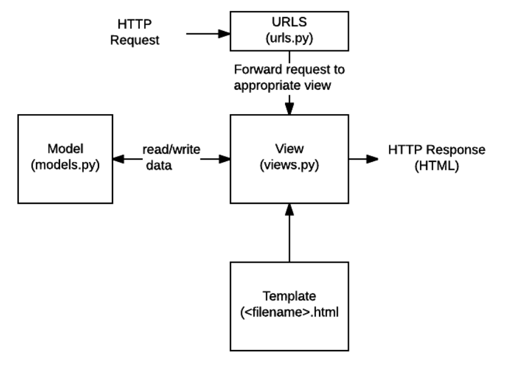

# DJANGO - Allgemein

## Allgemein

Django ist ein fortschrittliches Python-Webframework, mit dem schnell eine sichere und wartbare Website entwickelt werden kann. Django wird von erfahrenen Entwicklern entwickelt und ist für den größten Teil der Webentwicklung verantwortlich. Sie können sich also auf das Schreiben von Anwendungen konzentrieren, ohne das Rad neu erfinden zu müssen. Es ist kostenlos und Open Source, hat eine aktive Community, eine umfassende Dokumentation und viele kostenlose und kostenpflichtige Supportoptionen. [1]

## Django Struktur

- **URLs:** Während es möglich ist, Anforderungen von jeder URL über eine einzige Funktion zu verarbeiten, ist es viel einfacher, für jede Ressource eine separate Ansichtsfunktion zu schreiben. Ein URL-Mapper wird verwendet, um HTTP-Anforderungen basierend auf der Anforderungs-URL in die entsprechende Ansicht umzuleiten.
- **View:** Eine View ist eine Anforderungsbearbeitungsfunktion, die HTTP-Anforderungen empfängt und HTTP-Antworten zurückgibt. Ansichten können über Modelle auf Daten zugreifen.
- **Models:** Sind Python Objekte welche die die Struktur von Daten und deren Funktionen definieren.
- **Templates:** Eine Template ist eine Textdatei, die die Struktur oder das Layout einer Datei (z. B. einer HTML-Seite) definiert, wobei Platzhalter zur Darstellung des tatsächlichen Inhalts verwendet werden

## Quellen

[1] Django Introduction [online](https://developer.mozilla.org/en-US/docs/Learn/Server-side/Django/Introduction) | zuletzt besucht 20.01.2021

