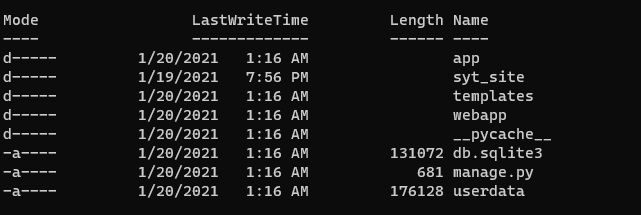

# DJANGO - Konfiguration

## Voraussetzung

* Python 3

  * > For Django 3.1.2 the allowed versions are Python 3.6 to 3.8 [1]

* Virtual Enviromennt

  * ```bash
    sudo pip3 install virtualenvwrapper
    ```

## Setup

### Virtual Enviroment

Um Django vollständig benutzen zu können benötigt man ein virtual Environment. Man erstell diese mit dem folgenden Befehl.

```bash
mkvirtualenv name_des_virtual_enviroments
```

#### venv benutzen

- `deactivate` — Exit out of the current Python virtual environment
- `workon` — List available virtual environments
- `workon name_of_environment` — Activate the specified Python virtual environment
- `rmvirtualenv name_of_environment` — Remove the specified environment.

### Django installieren

Das Django packet installieren

```bash
pip3 install django~=3.1
```

## Django Skelet erstellen

Im Verzeichnis, in welchen wir die Django Applikation erstellen führt man folgenden Befehl aus.

```bash
django-admin startproject name_der_seite
cd name_der_seite
```

Diese Befehl erstelle eine Orderstruktur mit weiteren Python-Skripten.

```bash
locallibrary/
    manage.py
    locallibrary/
        __init__.py
        settings.py
        urls.py
        wsgi.py
        asgi.py
```




## Applikation erstellen

Stellen Sie sicher, dass Sie diesen Befehl im selben Ordner wie die Datei "manage.py" Ihres Projekts ausführen

```bash
python3 manage.py startapp name_der_applikationn
```


## Applikation registrieren

Damit die Applikation von Django gescheit erkannt werden kann muss diese in bestimmten Konfigurationsdaten extra hinzugefügt werden.

**settings.py**

```bash
# catalog als Beispiel

INSTALLED_APPS = [
    'django.contrib.admin',
    'django.contrib.auth',
    'django.contrib.contenttypes',
    'django.contrib.sessions',
    'django.contrib.messages',
    'django.contrib.staticfiles',
    # Add our new application 
   'catalog.apps.CatalogConfig', #This object was created for us in /catalog/apps.py
]
```

## URL - Mapper Konfigurieren

Beispiel an "catalog"

```bash
# Use include() to add paths from the catalog application
from django.urls import include

urlpatterns += [
    path('catalog/', include('catalog.urls')),
]
```

## Django applikation ausführen

### Migrations

```bash
# Mit dem Befehl makemigrations werden die Migrationen für alle in Ihrem Projekt installierten Anwendungen erstellt (aber nicht angewendet)
python3 manage.py makemigrations
# Mit dem Befehl migrate werden die Migrationen auf Ihre Datenbank angewendet
python3 manage.py migrate
```

## RUN Server

```bash
python3 manage.py runserver
```

```bash
 Performing system checks...

 Django version 3.1, using settings 'website.settings'
 Starting development server at http://127.0.0.1:8000/
 Quit the server with CTRL-C.
```


## Quellen

[1] Setting up a Django development environment [online](https://developer.mozilla.org/en-US/docs/Learn/Server-side/Django/development_environment) | zuletzt besucht 20.01.2021

