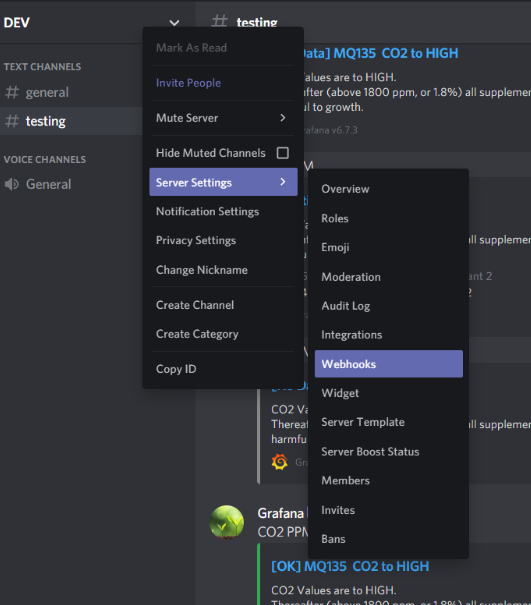
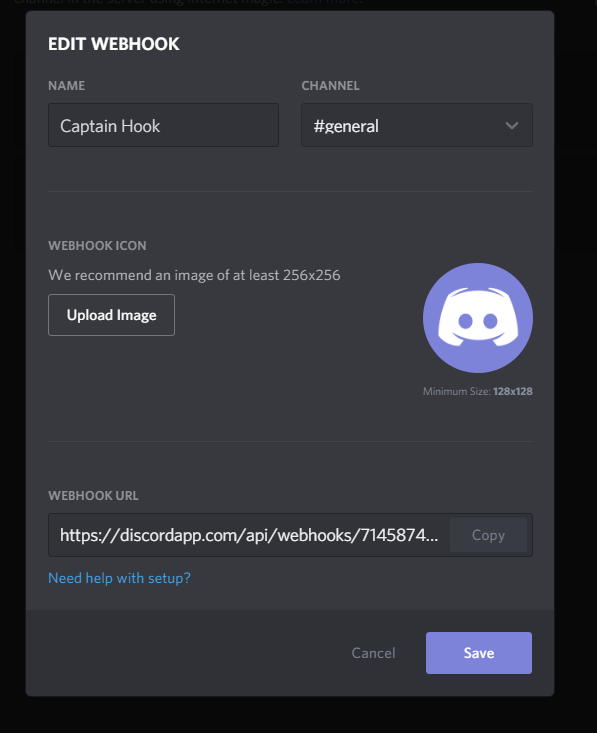

# Discord Webhook bekommen

Um eine Webhook für einen Discord Server zu bekommen muss man einfach auf einen Server (auf dem man gewisse Rechte besitzt) rechtsklick drücken. Dann muss man zum Reiter "Webhook" navigieren. [1]

Danach drückt man auf den Punkt "Create Webhook". Hier kann man den Namen und Bild der Webhook ändern (dies ist aber nicht Wichtig). Was für uns wichtig ist, ist die Webhook URL, welche wir dann auch bei Grafana angeben müsen.

## Quellen

[1] https://support.discord.com/hc/en-us/articles/228383668-Intro-to-Webhooks