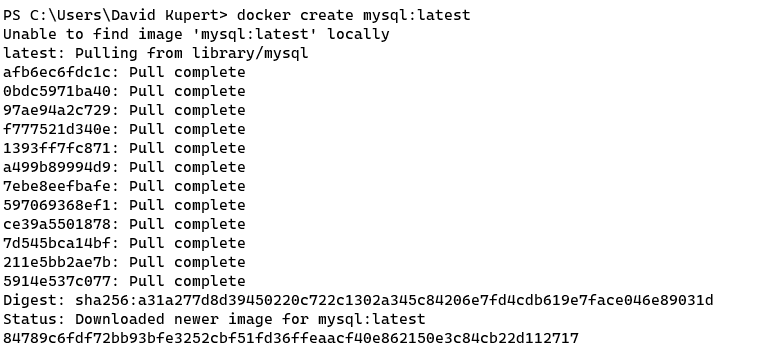
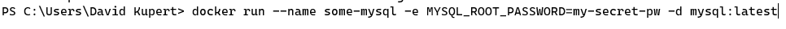
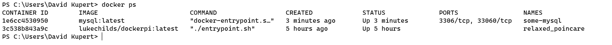
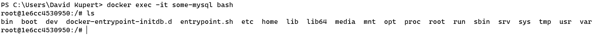

# Docker Allgemein

## Beschreibung

> Docker ist eine Software, welche die Container-Virtualisierung von Anwendungen ermöglicht. Anwendungen können inklusive ihrer Abhängigkeiten in ein Image gepackt werden. Mittels einer speziellen Engine kann die so verpackte Anwendung dann in einem Docker Container ausgeführt werden
>
> Bis auf einige Schnittstellen zu Betriebssystem oder Hardware ist die Applikation komplett isoliert. Es können beliebig viele Container aus einem Image erstellt und parallel betrieben werden, um zum Beispiel skalierbare Cloud-Dienste bereitzustellen. Container-Virtualisierung gibt es in vielen Varianten; Docker versucht, die Arbeit mit Containern möglichst praktisch und unkompliziert zu machen. [1]


## Docker Contrainer

Ein Container ist eine Stand Alone Software, die Code und alle seine Abhängigkeiten zusammenfasst, damit die Anwendung schnell und zuverlässig von einer Computerumgebung zur anderen ausgeführt werden kann. 

Ein Docker-Container-Image ist ein leichtes, eigenständiges, ausführbares Softwarepaket, das alles enthält, was zum Ausführen einer Anwendung erforderlich ist: Code, Laufzeit, Systemtools, Systembibliotheken und Einstellungen.[2]

## Docker Image

Container-Images werden zur Laufzeit zu Containern, und bei Docker-Containern werden Images zu Containern, wenn sie unter Docker Engine ausgeführt werden. Container-Software ist sowohl für Linux- als auch für Windows-basierte Anwendungen verfügbar und wird unabhängig von der Infrastruktur immer gleich ausgeführt. Container isolieren Software von ihrer Umgebung und stellen sicher, dass sie trotz Unterschieden beispielsweise zwischen Entwicklung und Bereitstellung einheitlich funktioniert. [2]

## Befehle

Das Sind die gängigsten Befehle [3,4]

| Befehl              | Beschreibung                                                 |
| ------------------- | ------------------------------------------------------------ |
| docker version      | List die Version des Docker Client und Docker Server auf     |
| docker login        | Mit diesen C´Befehl kann man sich in das "docker registry" anmelden |
| docker system prune | Löscht alle nicht benutzen Container, Netzwerke und Images   |
| docker run          | Erstellt einen neuen Container und starten diesen auch       |
| docker ls           | Listet alle laufenden Container                              |
| docker stop         | Stoppt einen laufenden Contrainer                            |
| docker kill         | Stoppt einen laufenden Container abrupt.                     |
| docker rm           | Löscht einen gestoppten Container                            |
| docker create       | Erstellt einen Container aus einem Images                    |

### Beispiel (MYSQL)

Als Beispiel für Docker habe ich mich für 'mysql' entschieden, alle verfügbaren Images könne auf Docker Hub gefunden werden. Diese besitzen auch eine ausführlichere Dokumentation. [5]

https://hub.docker.com/_/mysql

```bash
# Erstellt einen Contrainer aus der aktuellsten Version von MYSQL, welche für Docker geeignet ist
docker create mysql:latest
```



```bash
# Starten den Container mit den namen some-mysql (mit spezifischen Paramtern)
ocker run --name some-mysql -e MYSQL_ROOT_PASSWORD=my-secret-pw -d mysql:latest
```



```bash
# Alle aktiven Container
docker ps
```



#### interaktiver Modus

Da wir bei manchen Containern auch interaktiven arbeiten müssen, ermöglicht es uns Docker auch mit verschiedenen Containern zu interagieren. [6]

```bash
# Starten den Docker Container in einen interaktiven Modus.
docker exec -it some-mysql bash
```




## Quellen

[1] "Was ist docker" [online](https://www.dev-insider.de/was-ist-docker-a-733683/) | zuletzt besucht 25.05.2020

[2] "What container" [online](https://www.docker.com/resources/what-container) | zuletzt besucht 25.05.2020

[3] "15 Docker commands you should know" [online](https://towardsdatascience.com/15-docker-commands-you-should-know-970ea5203421) | zuletzt besucht 25.05.2020

[4] "Docker Cheat Sheet" [online](https://www.docker.com/sites/default/files/d8/2019-09/docker-cheat-sheet.pdf) | zuletzt besucht 25.05.2020

[5] "Docker Hub MySQL" [online](https://hub.docker.com/_/mysql)| zuletzt besucht 25.05.2020

[6] "Docker exec" [online](https://docs.docker.com/engine/reference/commandline/exec/) | zuletzt besucht 25.05.2020