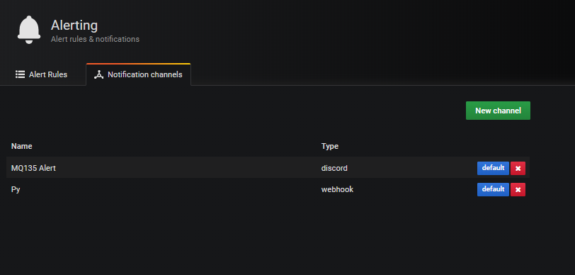
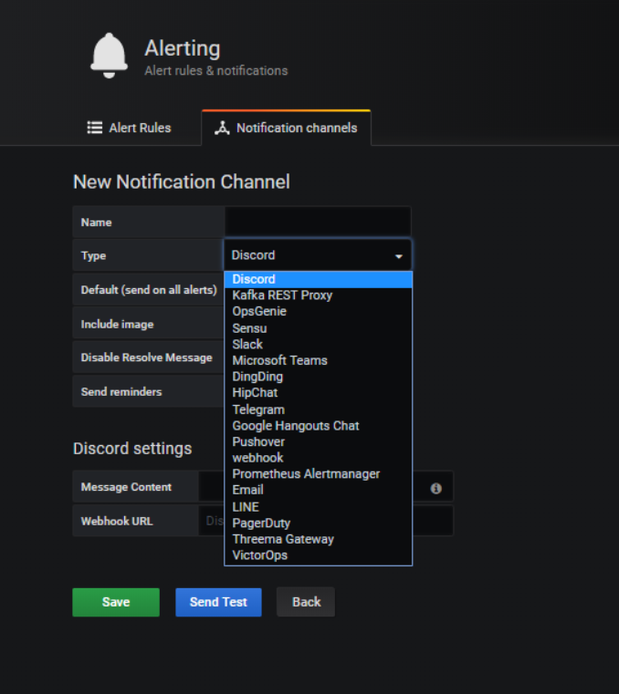
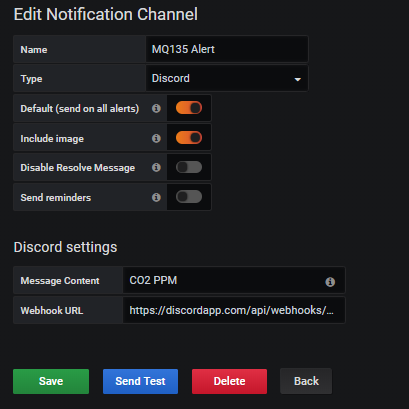
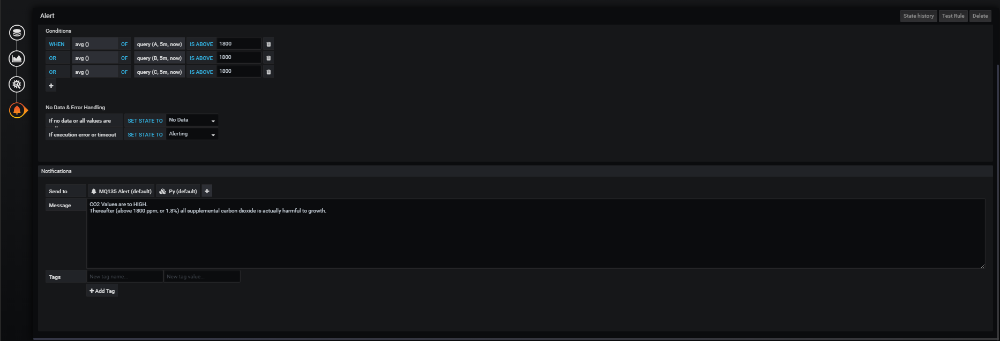
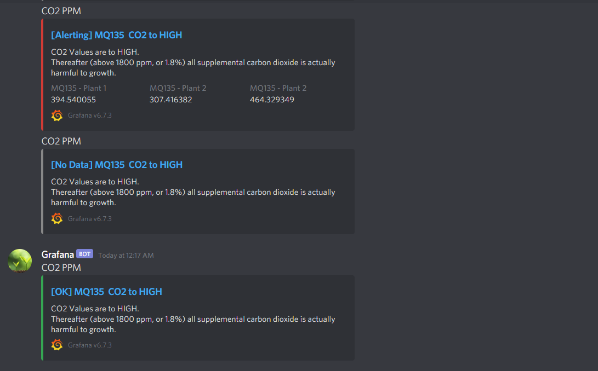

# Alerts in Grafana

Grafana bietet uns die Möglichkeit bei überschreiten bestimmter Werte in einer Datenbank uns zu "alamieren", diese Funktion wird Alerts genannt man kann auf verschiedene weisen Alerts setzen. Ich habe mich für Discord entschieden, da ich Discord alltäglich benutze.

Aber bevor wir zu Alerts kommen, müssen wir einen Notification Channel hinzufügen. [1,2]

Es gibt viele verschiedene Möglichkeiten

Danach müssen wir nur den Content der Message angeben und die Webhook. Zu der Webhook kommen wir später noch.

## Alert bei einen Graphen hinzufügen

Unter dem Punkt Alert kann man die Threshhold einstellen wann ein Alert getriggert werden soll.

## Discord Output

## Quellen:

[1] https://grafana.com/docs/grafana/latest/alerting/notifications/

[2] https://grafana.com/docs/grafana/latest/alerting/rules/