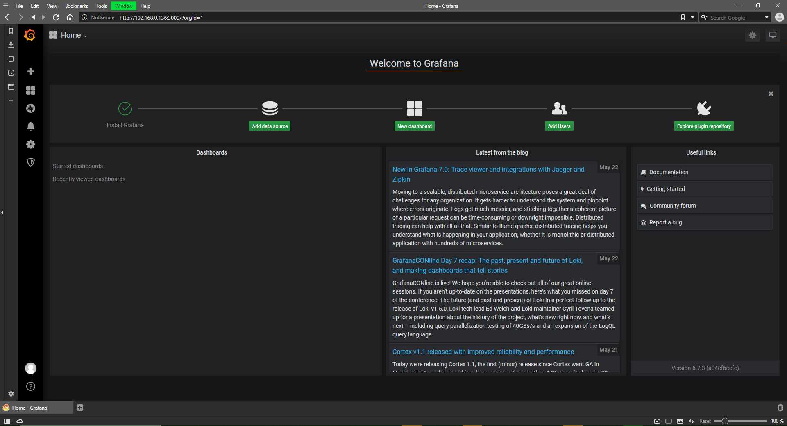
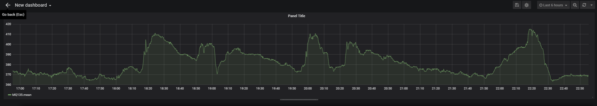

# Grafana

## Allgemein

Grafana ist eine Open Source Visualisierungs- und Analysesoftware. Man kann Metriken abfragen, visualisieren, alarmieren und untersuchen, unabhängig davon, wo sie gespeichert sind. Im Klartext erhaltet ,am Tools, mit denen man TSDB-Daten (Time Series Database) in wunderschöne Grafiken und Visualisierungen umwandeln können. [1]

## Konfigurieren

### Anmelden

Zu erst muss man sicher gehen, dass Grafana läuft und dann kann man die Webseite aufrufen. 

`192.168.0.136:3000`. In meinen Fall da, dass die IP-Adresse des Raspbies ist.

In default Anmeldedaten für den Admin (es ist empfohlen das Passwort des Admin zu ändern) [2]

* name: admin
* passwort: admin

### Datenbank hinzufügen

Folgender Output bekommt man wenn man sich das erste Mal erfolgreich angemeldet hat. Jetzt wird verlang Grafana zu konfigurieren.

Nun kommen wir zum Hinzufügen der InfluxDB. Hier bekommt man eine Liste an vielen unterschiedlichen Datenbanken, jetzt muss man InfluxDB auswählen, da wir mit Influx gearbeitet haben.

Folgende Daten muss man angeben.

* Name: ist egal
* Url: Ist die URL auf der die InfluxDB läuft
* Database: ist die Datenbank
* User: der User (am besten ist es hier nur Lese rechte zu haben)
* Password: Ist das Passwort des Users

Am Ende kann man das auch austesten ob sich Grafan mit der Datenbank verbinden kann.

## Dashboard

Auf dem Dashbaord werde alle Plot und Graphen angezeigt. Bei einem leeren Dashboard schlagt und Grafana vor eine Query oder eine Plot hinzuzufügen

Wir fangen mit einer Query an. Hier hilft uns Grafana und gibt direkt Vorschläge für mögliche Query abfragen.

Eine fertige Abfrage:

Graph:

Man kann natürlich auch das Design des Graphen ändern und auch die Achsen formatieren. Diese sind aber jetzt für den generellen Einblick in Grafana nicht wichtig.

## Quellen

[1] "What is Grafana" [online](https://grafana.com/docs/grafana/latest/getting-started/what-is-grafana/) |zuletzt besucht 26.05.2020

[2] "MONITORING TEMPERATURE AND HUMIDITY WITH A RASPBERRY PI 3, DHT22 SENSOR, INFLUXDB AND GRAFANA" [online](https://www.definit.co.uk/2018/07/monitoring-temperature-and-humidity-with-a-raspberry-pi-3-dht22-sensor-influxdb-and-grafana/) |zuletzt besucht 26.05.2020