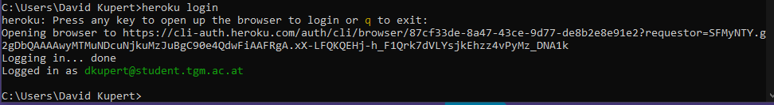

# HEROKU - Allgemein

## Allgemein

Heroku ist eine containergestützte Cloud Platform as a Service (PaaS). Entwickler verwenden Heroku, um moderne Apps bereitzustellen, zu verwalten und zu skalieren.[1] [2]

Heroku unterstützt folgende Programmiersprachen:

* Node.js
* Ruby
* Java
* Python
* PHP
* GO
* Scala

## Anforderungen

* Heroku Account [hier](https://signup.heroku.com/dc) 
* Python version 3.7

### Installieren [3]

HEROKU installieren

Ubuntu:

```bash
sudo snap install heroku --classic
```

Nach der Installation muss man sich in der CLI in HEROKU anmelden

```bash
heroku login
```



## Deployen [4]

Eine HEROKU Applikation erstellt man in einem GIT-Repo

```bash
heroku create
```

Um HEROKU endgültig zu deployen benutzt man diesen Befehl:

```bash
git push heroku main
```

 HEROKU App Browser öffnen:

```bash
heroku open
```

## HEROKU.YML [5]

Die Datei heroku.yml ist ein Manifest, mit dem man eine Heroku-App definieren können. Es können Docker Contrainer geladen werden.

Beispiel für ein solches `heroku.yml`-File

```yaml
build:
  docker:
    web: Dockerfile
run:
  web: bundle exec puma -C config/puma.rb
```

### HEROKU - File hochladen

```bash
git add heroku.yml
git commit -m "Add heroku.yml"

heroku stack:set container

git push heroku master
```

## Quellen

[1] HEROKU Dev Center [online ](https://devcenter.heroku.com) | zuletzt besucht 20.01.2021

[2] HEROKU About [online](https://www.heroku.com/about)| zuletzt besucht 20.01.2021

[3] Heroku gettinng started with python [online](https://devcenter.heroku.com/articles/getting-started-with-python#set-up)| zuletzt besucht 20.01.2021

[4] Deploy App Heroku [online](https://devcenter.heroku.com/articles/getting-started-with-python#deploy-the-app)| zuletzt besucht 20.01.2021

[5] Heroku.yml [online](https://devcenter.heroku.com/articles/build-docker-images-heroku-yml) | zuletzt besucht 20.01.2021

