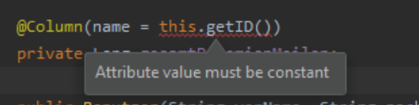

# Hibernate Validation

## Constraints

Um die Möglichkeiten eines Attributes einzuschränken kann man Constraints benutzen. [1,2]

| Annotation              | Description                                                  |
| ----------------------- | ------------------------------------------------------------ |
| @FutureOrPresent        | Checks whether the annotated date is in the present or future |
| @Past                   | Checks whether the annotated date is in the past.            |
| @Pattern(regex=, flag=) | Checks if the annotated string matches the regular expression *`regex`* considering the given flag *`match`*. |
| @Size(min=, max=)       | Check if the annotated element size is between min and max (inclusive). |
| @CreditCardNumber       | The annotated element has to represent a valid credit card number. |
| @EAN                    | Checks that the annotated character sequence is a valid EAN 13 number. |
| @Email                  | The string has to be a well-formed email address.            |
| @Length                 | Validate that the string is between min and max included.    |
| @LuhnCheck              | Luhn algorithm check constraint.                             |
| @Mod10Check             | Modula 10 check constraint                                   |
| @NotBlank               | Validate that the annotated string is not `null` or empty.   |
| @NotEmpty               | Asserts that the annotated string, collection, map or array is not `null` or empty. |
| @Range                  | Defines several `@Range` annotations on the same element.    |
| @SafeHtml               | Validate a rich text value provided by the user to ensure that it contains no malicious code, such as embedded <script> elements. |
| @URL                    | Validate that the string is a valid URL.                     |
| @Future                 | Checks whether the annotated date is in the future.          |
| @Range(min=, max=)      | Check whether the annotated value lies between (inclusive) the specified minimum and maximum. |

Natürlich gibt es noch viel mehr. 

## Custom Constraints

Für ein Custom Constraint benötigt man zwei Klassen --> eine Constraint (bzw. Annotation) und einen Validator. [3,4]

### Die Constraint / Annotation Klasse

```java
//@Target beschreibt die unerstützen element typen die man benutzen kann
@Target({ METHOD, FIELD, ANNOTATION_TYPE, CONSTRUCTOR, PARAMETER, TYPE_USE })
//@Retention beschreibt wann die validierung statt findet
@Retention(RUNTIME)
//@Constraint bestimmt anhand, welcher Klasse validiert wird.
@Constraint(validatedBy = {IsSameValidator.class})
public @interface IsSame {
    String message() default "";
    Class<?>[] groups() default { };
    Class<? extends Payload>[] payload() default { };
    //Attribute der Annotation
    String first();
    String secound();
    @Target({ METHOD, FIELD, ANNOTATION_TYPE, CONSTRUCTOR, PARAMETER, TYPE_USE })
    @Retention(RUNTIME)
    @Documented
    @interface List {
        IsSame[] value();
    }
}
```

#### Validator Klasse

```java
//Hier ist es wichtig, dass das Erste Elemnt die Klasse des Constraints ist
//Als zweites wird das zu kontrollierende Objekt übertragen
public class IsSameValidator implements ConstraintValidator<IsSame, Object> {
    //Attribute
    protected String first;
    protected String secound;
    //Diese Methode wird beim Aufruf der Annotation ausgeführt
    @Override
    public void initialize(final IsSame constraintAnnotation) {
        this.first = constraintAnnotation.first();
        this.secound = constraintAnnotation.secound();
    }
    //Diese Methode beinhaltet die ganze Logik für die Annotation
    // wenn sie 'false' returned ist das Constraint nicht erfüllt worden
    // bei einem 'true' jedoch ist es erfüllt worden
    @Override
    public boolean isValid(final Object value, ConstraintValidatorContext constraintValidatorContext){
    }
}
```

### Problem

Das Attribut des Constraint muss constant sein. Einen Weg drumherum ist es den Variablennamen des Attributes anzugeben und mit BeanUtils weiter zu arbeiten. [5]



```java
final Object startObj = BeanUtils.getProperty(value.getName(), this.first).toString();
final Object endeObj = BeanUtils.getProperty(value.getName(), this.secound).toString();
```

### Validation überprüfen

Um die Constraints zu überwachen kann man eine Validator Factory verwenden.  Anhand der Validator Factory kann daraufhin ein Validator erstellt werden, welcher daraufhin sämtliche Constraints eines Objekts checken kann. [6]

```java
public static void validate(Object obj) {
    ValidatorFactory factory = Validation.buildDefaultValidatorFactory();
    Validator validator = factory.getValidator();
    Set<ConstraintViolation<Object>> violations = validator.validate(obj);
    for (ConstraintViolation<Object> violation : violations) {
        log.error(violation.getMessage());
        System.out.println(violation.getMessage());
    }
}
```

## Quellen

[1] : "Chapter 2. Validation step by step" [online](https://docs.jboss.org/hibernate/validator/4.1/reference/en-US/html/validator-usingvalidator.html#validator-usingvalidator-annotate) | zuletzt besucht 28.04.2020

[2] : "Package org.hibernate.validator.constraints" [online](https://docs.jboss.org/hibernate/validator/5.1/api/org/hibernate/validator/constraints/package-summary.html) | zuletzt besucht 28.04.2020

[3] : "Create your own constraint with bean validation" [online](https://dzone.com/articles/create-your-own-constraint-with-bean-validation-20) | zuletzt besucht 28.04.2020

[4] "Validator custom constraints Validator" [online](https://docs.jboss.org/hibernate/validator/5.0/reference/en-US/html/validator-customconstraints.html#validator-customconstraints-validator) | zuletzt besucht 28.04.2020

[5] : "Cross field validation with hibernate" [online](https://stackoverflow.com/questions/1972933/cross-field-validation-with-hibernate-validator-jsr-303) | zuletzt besucht 28.04.2020

[6] : "JAVAX Validation" [online](https://www.baeldung.com/javax-validation) | zuletzt besucht 28.04.2020