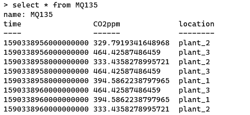
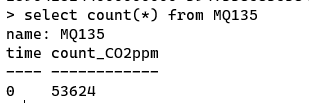
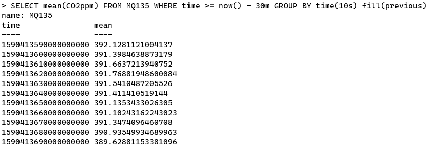

# InfluxDB 

## Allgemein

InfluxDB ist eine time series database, die für hohe Schreib- und Abfragelasten ausgelegt ist. Es ist ein integraler Bestandteil des TICK-Stacks. InfluxDB soll als Hintergrundspeicher für alle Anwendungsfälle verwendet werden, bei denen große Mengen von timestamped data verwendet werden, einschließlich DevOps-Überwachung, Anwendungsmetriken, IoT-Sensordaten und Echtzeitanalysen. [1]

> InfluxDB is the open source time series database that is part of the TICK (Telegraf, InfluxDB, Chronograf, Kapacitor) stack. It is designed to handle high write and query loads and provides a SQL-like query language called InfluxQL for interacting with data. [2]

## Features

Hier sind einige der Funktionen, die InfluxDB derzeit unterstützt und die es zu einer hervorragenden Wahl für die Arbeit mit Zeitreihendaten machen.[1]

* Benutzerdefinierter Hochleistungsdatenspeicher, der speziell für time series data geschrieben wurde. Die TSM-Engine ermöglicht eine hohe Aufnahmegeschwindigkeit und Datenkomprimierung 
* In Go geschrieben. 
*  Leistungsstarke HTTP-APIs zum Schreiben und Abfragen. 
* Plugins unterstützen andere Datenerfassungsprotokolle wie Graphite, collectd und OpenTSDB. 
* SQL-ähnliche Abfragesprache, die auf die einfache Abfrage aggregierter Daten zugeschnitten ist. 
* Durch Tags können Serien für schnelle und effiziente Abfragen indiziert werden. 
* Kontinuierliche Abfragen berechnen automatisch aggregierte Daten, um häufige Abfragen effizienter zu gestalten.

## Befehle

#### Datenbank erstellen

```sql
-- Erstellt die Datenbank 'sensor_data'
create database sensor_data
-- Switch auf die Datenbank 'sensor_data'
use sensor_data
```

#### User erstellen / Priviliges

```sql
-- Erstelle den User Admin
create user admin with password 'admin'
-- Setzt die Erlaubnis für den User Admin
-- all / Alles
-- read / nur lesen
-- write / schreiben
grant all privileges to admin
```

##### Achtung

Hier ist die Setzung der Anführungszeichen sehr wichtig.

### Abfragen

Hier sind Beispiel für gängige Commands[]

```sql
-- Gibt alle Einträge von MQ135 ab.
select * from MQ135
```



```sql
-- Gibt die Anzahl der Einträge von MQ135 aus
select count(*) form MQ135
```



```sql
-- Gibt den Mittelwert der CO2 Werte alle Pflanzen in den letztzen 30 min aus in jeweils 10s abständen | wenn kein Wert vorhanden ist wird der vorherige genommen
SELECT mean(CO2ppm) FROM MQ135 WHERE time >= now() - 30m GROUP BY time(10s) fill(previous)
```



## Quellen

[1] "InfluxDB Documentation" [online](https://docs.influxdata.com/influxdb/v1.8/) | zuletzt besucht 25.05.2020

[2] "InfluxDB Overview" [online](https://www.influxdata.com/products/influxdb-overview/) | zuletzt besucht 25.05.2020

[3]  "CLI InfluxDB" [online](https://v2.docs.influxdata.com/v2.0/reference/cli/influx/) | zuletzt besucht 25.05.2020

[4] "Influx Shell" [online](https://docs.influxdata.com/influxdb/v1.8/tools/shell/) | zuletzt besucht 25.05.2020