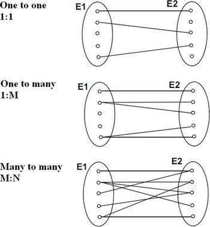

# JPA-Annotations

## Grundlegende Annotation

### @Entity

Damit eine Klasse als Entity erkannt werden kann braucht diese vor der Klassen Definition die Annotation `@Entity`.

```JAVa
//Mit dieser Annotation wird das Objekt als Entity gekennzeichnet
@Entity
public class Beispiel {   
	private String bsp;
}
```

### @Table

Normalerweise wird der Name der Klasse als Tabellename genommen, möchte man diese nun nicht muss man die Annotation `@Table()` benutzen. Des Weiteren muss man das Attribut `name`  bestimmen. [1]

```java
@Entity
@Table(name="tbl_sky")
public class Sky implements Serializable {
   ...
}  
```

### @Column

Wie vorher bereits erwähnt, wenn man ein Attribut genauer bestimmen möchte muss man ``@Column()` benutzen. Das Sind alle möglichen Attribute, welche `@Column` besitzen Die einzelnen Attribut automatisch als Spalte erkannt, man kann mit `@Column` arbeiten damit man genauer Werte festsetzen kann. [1]

```java
@Column(
    name="colu(1)mnName";
    boolean un(2)ique() default false;
    boolean nu(3)llable() default true;
    boolean in(4)sertable() default true;
    boolean up(5)datable() default true;
    String col(6)umnDefinition() default "";
    String tab(7)le() default "";
    int length(8)() default 255;
    int precis(9)ion() default 0; // decimal precision
    int scale((10)) default 0; // decimal scale
)
```

Eine genauere Beschreibung der optionalen Attribute [1]

* `unique` (optional): set a unique constraint on this column or not (default false)
* `nullable` (optional): set the column as nullable (default true).

* `insertable` (optional): whether or not the column will be part of the insert statement (default true)
* `updatable` (optional): whether or not the column will be part of the update statement (default true)
* `columnDefinition` (optional): override the sql DDL fragment for this particular column (non portable)
* `table` (optional): define the targeted table (default primary table)
* `length` (optional): column length (default 255)
* `precision` (optional): column decimal precision (default 0)
* `scale` (optional): column decimal scale if useful (default 0)

### @ID / @GeneratedValue

`@ID` deklariert die Bezeichner-Eigenschaft dieser Entität. Die anderen Zuordnungsdeklarationen sind implizit. Mit der Annotation @Id können Sie definieren, welche Eigenschaft die Kennung Ihrer Entität ist. Diese Eigenschaft kann von der Anwendung selbst festgelegt oder vom Ruhezustand generiert werden (bevorzugt). Sie können die Strategie zur Generierung von Bezeichnern mithilfe der Annotation @GeneratedValue definieren. [1]

Dies sind die folgenden Strategien, welche von JPA zur Verfügung gestellt werden:

* AUTO - either identity column, sequence or table depending on the underlying DB
* TABLE - table holding the id
* IDENTITY - identity column
* SEQUENCE - sequence
* identity copy - the identity is copied from another entity

```JAVA
@Id @GeneratedValue(strategy=GenerationType.IDENTITY)
public Long getId() { ... }   
```

### @Transient

Wenn man nun ein Attribut einer Klasse hat was nicht gespeichert werden soll, muss man dieses mit der Annotation `@Transient` versetzen. [1]

```java
public transient int counter; //transient property

private String firstname; //persistent property

@Transient
String getLengthInMeter() { ... } //transient property

String getName() {... } // persistent property

@Basic
int getLength() { ... } // persistent property

@Basic(fetch = FetchType.LAZY)
String getDetailedComment() { ... } // persistent property

@Temporal(TemporalType.TIME)
java.util.Date getDepartureTime() { ... } // persistent property  
```

### @Enumarated

Hat man jetzt einen ENUM als Attribut so muss man dieses auch mit einer Annotation kennzeichnen. Hier muss man entscheiden,  was für ein Typ unser ENUM ist. Standardmäßig ist der EnumTyp Ordinal. [1]

* ORDINAL: ein Zahlenwert
* STRING: eine Zeichenkette

```java
@Column(name = "typ")
@Enumerated(EnumType.STRING)
private ZeitkartenTyp typ;

```

## Foreign Keys

Wenn man nun Attribute besitzt die ein Objekt einer anderen Entität sind (sind die als FK zusehen) um ein Attribut mit `@OneToOne` oder `@OneToMany` und dann noch dazu `@JoinColumn(name = ``)` mit dem Namen der Spalter versehen. Die Annotation sind sehr Selbs sprechend und können mit einem gewissen Vorwissen auch einfach verstehen. [1]



### @OneToOne

```java
@OneToOne
@JoinColumn(name = "ende")
private Bahnhof ende;
```

### @OneToMany

```java
@OneToMany
@JoinColumn(name = "ende")
private Bahnhof ende;
```

### @ManyToOne

```java
@OneToMany
@JoinColumn(name = "ende")
private Bahnhof ende;
```

### @ManyToMany

```java
@ManyToMany
@JoinColumn(name = "ende")
private Bahnhof ende;
```

## Quellen

[1] : "Hibernate Annotations - Documentation" [online](Hibernate Annotations) | zuletzt besucht 28.04.2020


