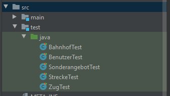
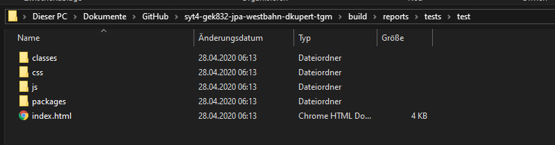
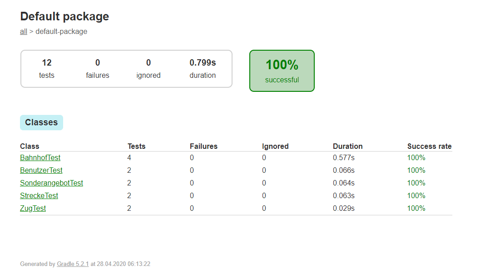

# JUnit with Gradle

## Test-Directory anlegen 

Um mit Gradel Testen zu können ist es wichtig die Test in ein bestimmtes Verzeichnis zu geben. Gradle benutzt dazu das als Standard Verzeichnis: [1]

`main --> test --> java --> TestClass.java`



## Dependencies

Wie so viele Frameworks hat auch  JUnit bestimmte dependencies. [2]

```build.gradle
testCompile 'junit:junit:4.12'
compile 'junit:junit:4.12'

testCompile group: 'org.hamcrest', name: 'hamcrest-core', version: '1.3'
testCompile group: 'junit', name: 'junit-dep', version: '4.10'
testCompile group: 'org.hamcrest', name: 'hamcrest-library', version: '1.3'
testCompile group: 'org.mockito', name: 'mockito-core', version: '1.9.+'

testImplementation(
'junit:junit:4.12',
)
```

## JUnit Klasse

Die allgemeine Struktur einer JUnit sieht wie folgt aus. [3]

``` java
public class Test {

    @Test
    public void checkIfBahnhofnameIsTooShort() {
        assertTrue(true);
    }
}
```

* Mit der Annotation @Test wird diese Methode als Test gekennzeichnet 
* Jede Methode welche `assert` beinhaltet erwartet einen gewissen Wert oder Ereignis --> wenn dieses erfüllt wurde, wird der Test als bestanden markiert.

## Gradle generierter Testbericht

 Gradle besitzt die Möglichkeit die Test auszuführen und diese in einer `.html`-Datei zusammenfassen.





[1] : "The Java Plugin - Gradle User Manual" [online](https://docs.gradle.org/current/userguide/java_plugin.html) | zuletzt besucht 28.04.2020

[2] : "How to run JUnit gradle" [online](https://stackoverflow.com/questions/9606904/how-to-run-junit-testsuites-from-gradle) | zuletzt besucht 28.04.2020

[3] : "Gradle Dependency" [online](https://github.com/junit-team/junit4/wiki/Use-with-Gradle) | zuletzt besucht 28.04.2020