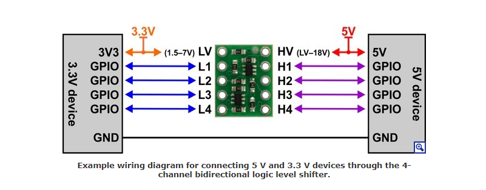

# 4 Channel Logic Level Converter - Bi-Directional

## Allgemein

Da digitale Geräte immer kleiner und schneller werden, ist die allgegenwärtige 5-V-Logik immer niedrigeren Spannungsstandards wie 3,3 V, 2,5 V und sogar 1,8 V gewichen, was zu einem Ökosystem von Komponenten führt, die ein wenig Hilfe benötigen, um miteinander zu sprechen. 

Beispielsweise kann ein 5-V-Teil ein 3,3-V-Signal nicht so hoch lesen, und ein 3,3-V-Teil kann durch ein 5-V-Signal beschädigt werden. Der LLC  löst diese Probleme, indem er eine bidirektionale Spannungsumsetzung von bis zu vier unabhängigen Signalen bietet und zwischen Logikpegeln von nur 1,5 V auf der Niederspannungsseite und bis zu 18 V auf der Hochspannungsseite und seiner kompakten Größe konvertiert Der Steckbrett-kompatible Stiftabstand erleichtert die Integration in Projekte. [1,2]

## Quellen

[1] https://www.pololu.com/product/2595

[2] https://electronics.semaf.at/4-Channel-Logic-Level-Converter-Bi-Directional

