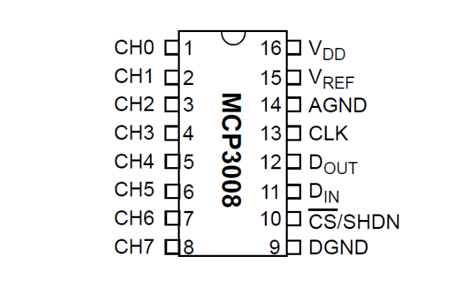

# MCP3008

## Allgemein

Der MCP3008 ist ein kostengünstiger 8-Kanal-10-Bit-Analog-Digital-Wandler. Die Präzision dieses ADC ähnelt der eines Arduino Uno, und mit 8 Kanälen können Sie einige analoge Signale vom Pi lesen. Dieser Chip ist eine großartige Option, wenn Sie nur einfache analoge Signale wie einen Temperatur- oder Lichtsensor lesen müssen. Wenn Sie mehr Präzision oder Funktionen benötigen, lesen Sie die ADS1x115-Serie auf der nächsten Seite. 

Bevor man den MCP3008 verwenden, sollte man diese ältere Anleitung zum Raspberry Pi MCP3008 überfliegen, um weitere Informationen zur Verwendung mit dem Raspberry Pi zu erhalten. Verwenden Sie jedoch nicht den Code aus dem älteren Handbuch, da er veraltet ist. [1]

## Quellen

[1]  https://learn.adafruit.com/raspberry-pi-analog-to-digital-converters/mcp3008