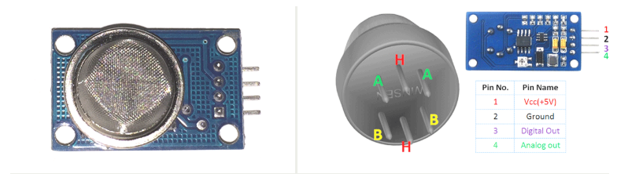
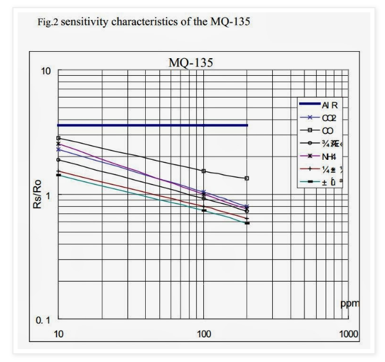

# MQ135

## Allgemein

MQ135 ist ein Luftqualitätssensor zum Nachweis von NH3, Alkohol, Benzol und anderen Gasen. [1,2]

Load Widerstand: Rl 10k Ohm bis 47 k Ohm [2]

## Berechnen

Die "*sensitivity characteristics of the MQ-135*" des Datenblattes werden verwendet, um die Ausgabe des Sensors in die zugehörigen physikalischen Eigenschaften in ppm für das zu testende Gas umzuwandeln. [1]

Die obige Grafik scheint eine Power-Funktion zu sein:
$$
y = a * x ^ b 
$$
 Und so mit kann man sich den ppm-Wert ausrechenen
$$
ppm = a * (Rs / Ro) ^ b
$$
Mithilfe der Leistungsregression können wir den Skalierungsfaktor (a) und den Exponenten (b) für das Gas erhalten, das wir messen möchten 
$$
Ro = Rs * sqrt (a / ppm, b) = Rs * exp (ln (a / ppm) / b)
$$
 Wenn wir also einen Sensor kalibrieren möchten, benötigen wir "nur" eine bekannte Menge eines bestimmten Gases, dann können wir den Widerstandsausgangswert vom Sensor (Rs) ablesen und den kalibrierten Ro-Wert berechnen. 

Wir kennen die aktuelle Menge an CO2-Gas in der Atmosphäre http://co2now.org/, wir können dies als Referenz für die Kalibrierung verwenden. Das Datenblatt gibt an, dass wir sogar den Konzentrationsumfang für ein bestimmtes Gas ermitteln, damit wir den Grenzwert für Rs / Ro berechnen können. 
$$
Rs / Ro_limit = (ppm / a) ^ (1 / b)
$$
Die Skalierung der Werte ist allerdings nicht linear sondern logarithmisch zur Basis 10 (log). Das bedeutet, dass der erste Strich auf der X-Achse 200 entspricht, danach 300 usw. Der erste Strich nach 1000 ist 2000, usw. Der Abstand dazwischen ist linear. Die Idee, welche hinter der  Kalibrierung und Auslesung steckt, ist eine Gerade zu erstellen und so den Anteil des Gases (in ppm) zu berechnen. Dazu brauchen wir zwei Punkte, um die Steigung zu berechnen.

. Um die „echten“ Werte zu berechnen, wenden wir den Zehner-Logarithmus an. Mit Hilfe der Zwei-Punkte Form) können wir die Steigung berechnen, die in unserem Fall [3]

Da ich nun ein CO2-Messgerät bauen möchte, versuchen wir, diesen Sensor für die Messung von CO2 zu kalibrieren. Wenn wir für CO2 ein Punktdiagramm messen und eine Leistungsregression durchführen, können wir die Funktion erhalten 
$$
ppm = 116,6020682 (Rs / Ro) ^ - 2,769034857
$$
Wir wissen auch, dass die derzeitige Menge an CO2-Gas in der Atmosphäre 416 ppm beträgt. 

## Achtung

Bevor man mit den Sensor genaue Werte bekommt muss man diesen 24 Stunden in der freien Lust warm werden lasse. Es ist wichtig, dass sich der Sensor in guter / frischer Luft befindet, da Rauch / andere Gase die Kalibrierung verfälschen würden. [1,3]

Da MQ135 elektrochemische Sensoren sind, erwarte ich nicht, dass alle Sensoren die gleiche Kurve haben.[1]

## Quellen

[1] "Cheap Co2 meter using mq135" [online](http://davidegironi.blogspot.com/2014/01/cheap-co2-meter-using-mq135-sensor-with.html) |zuletzt besucht 26.05.2020 

[2] "MQ135 - Datasheet" [online](https://components101.com/sensors/mq135-gas-sensor-for-air-quality) |zuletzt besucht 26.05.2020

[3] "MQx Python tutorial" [online](https://tutorials-raspberrypi.de/raspberry-pi-gas-sensor-mq2-konfigurieren-und-auslesen/) |zuletzt besucht 26.05.2020