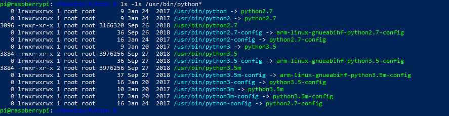

## Python Executable

#### Requirments.txt

Damit sich der Benutzer des Programmes keine weiteren Packages nachinstallieren muss habe ich eine `Requierments.txt` Datei hinzugefügt, welche mit dem Befehl:

```python
pip install -r requirements.txt
```

alle Aufgelisteten Pakete nachinstalliert.  [1]

#### Executable Bit

Bevor man die Datei von sich aus Ausführbar macht, sollte man spezifizieren, welche Version von Python benutzt werden soll.

Ist man sich jetzt nicht sicher, welche Version man von Python auf einem Gerät installiert sollte man den Befehl `ls -ls /usr/bin/python*` eingeben. Die Ausgabe sollte folgendermaßen aussehen.



Um jetzt festzulegen muss man in der ersten Zeile des Python-Codes die Version, welche benutzt werden soll eingeben.

```python
#!/usr/bin/python3.5
```

Nun kann man die Datei mit folgenden Linux-Befehl in eine ausführbare Datei umwandeln.

``` bash
chmod +x filename
```

Danach kann man dieses Datei mit 

```bash
./filename
```

ausführen.

## Quellen

[1] : "Requierment.txt " [online](https://pip.pypa.io/en/stable/user_guide/) | zuletzt besucht 19.01.2020

