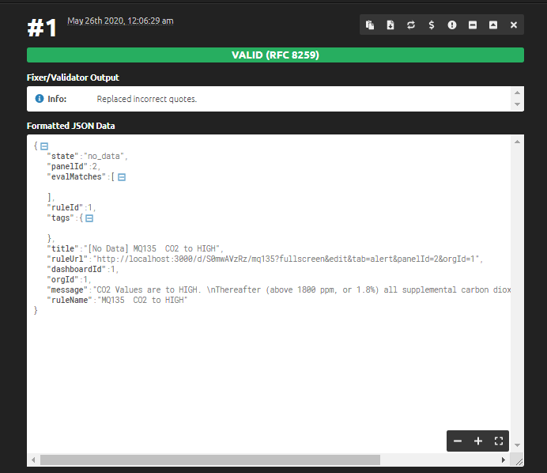

# Python Webhook

Damit wir mit der  Funktionsüberprüfung überhaupt, müssen wir sicherstellen, dass ein Python Programm auf Webhooks reagieren kann.

Diese erreichen wir mit Flask.

## Struktur des Programmes

```python
from flask import Flask, request, abort

app = Flask(__name__)


# Hier ist es wichtig die Methode POST zu benutzen
@app.route('/webhook', methods=['POST'])
def webhook():
    if request.method == 'POST':
        # Hier bekommt man den Inhalt
        jsonObject = request.json
        status = jsonObject['state']
        print(status)

        if status == 'ok':
            print("ok")
        if status == 'no_data':
            print("no data")
        if status == 'alerting':
            print("altert")
        return '', 200
    else:
        return "okay"

# Die Settings der App
if __name__ == '__main__':
    app.run(host='0.0.0.0')

```

## Inhalt der Webhook

Der Inhalt besitzt eine bestimmte JSON Struktur, und auf bestimmte Attribute kann unser Programm dann reagieren.

```json
{
   "state":"no_data",
   "panelId":2,
   "evalMatches":[

   ],
   "ruleId":1,
   "tags":{

   },
   "title":"[No Data] MQ135  CO2 to HIGH",
   "ruleUrl":"http://localhost:3000/d/S0mwAVzRz/mq135?fullscreen&edit&tab=alert&panelId=2&orgId=1",
   "dashboardId":1,
   "orgId":1,
   "message":"CO2 Values are to HIGH. \nThereafter (above 1800 ppm, or 1.8%) all supplemental carbon dioxide is actually harmful to growth.",
   "ruleName":"MQ135  CO2 to HIGH"
}
```

Hier interessiert uns nur der state dieser kann folgende Zustände annehmen:

* ok --> Daten sind OK
* no data --> Keine Daten
* alerting --> Ein Alert wurde aufgerufen



## Quellen

[1] https://www.herox.com/IARPAGFChallenge/forum/thread/2497?page=1#post-8920

[2] https://sendgrid.com/docs/for-developers/tracking-events/python-code-example/

[3] https://developers.google.com/hangouts/chat/quickstart/incoming-bot-python