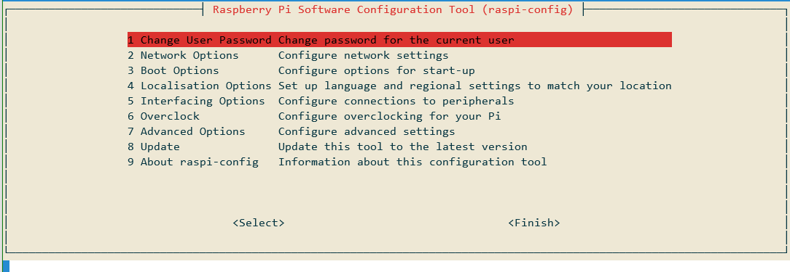
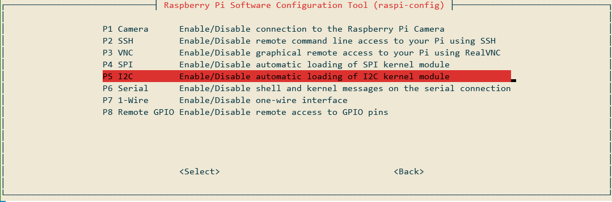
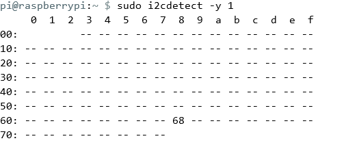

## SPI und I2C bei einem Raspberry PI [1]

### Konfiguration

ALs erstes sollten man beim Raspberry PI SPI und I2C in den Konfigurationen aktivieren, mit dem Befehl `sudo raspi-config` gelangt man in die Konfigurationen. Danach navigiert man zum Reiter Interfacing Option und aktiviert SPI und I2C. 





### Tools

jetzt sollten wir natürlich auch wissen ob und wenn ja auf, welche Adresse unsere Komponenten angeschlossen sind. Dazu benutzen wir i2cdetect, welches im Package i2c-tools vorhanden ist.

```bash
sudo apt-get install i2c-tools python-smbus
```

Führen wir nun einen "detect" mit angeschlossenem Gerät aus

```bash
sudo i2cdetect -y 1
```




Um das Gerät mit Adresse 68 unter dem Register anzusprechen geben wir folgendes ein:

 ```bash
sudo i2cget -y 1 0x68 0x75
 ```

### Quellen

[1] "Rotation und Beschleunigung mit dem Raspberry Pi messen" [online](https://tutorials-raspberrypi.de/rotation-und-beschleunigung-mit-dem-raspberry-pi-messen/) | zuletzt besucht 22.01.2020

