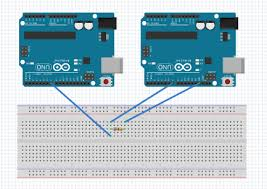

### Common-Ground

Ein großes Problem, was ich bei der Durchführung der Übung hatte war es auf die Idee des Common Ground (grob Übersetzt: Gemeinsame Erdung) zu kommen. Spannung ist Relativ. Eine Spannung macht nur Sinn, wenn sie eine andere Spannung hat mit der man sie vergleichen kann. Dieser Referenzpunkt ist die Erdung. Wenn zwei unterschiedliche Komponenten mit einander Kommunizieren wollen sollten sie den selben Referenzpunkt besitzen.[1,2]

Veranschaulichung des Common-Ground anhand 2 Arduinos. [3]

## Quellen

[1] : "Why do networks need a common ground cable" [online](https://electronics.stackexchange.com/questions/38298/why-do-networks-need-a-common-ground-cable/38300#38300) | zuletzt besucht 19.01.2020

[2] : "Common-Ground Arduino" [online](https://forum.arduino.cc/index.php?topic=338990.0)  | zuletzt besucht 20.01.2020

[3] : "Common-Ground wih 2 Arduinos" [online](https://forum.arduino.cc/index.php?topic=443417.0) | zuletzt besucht 20.01.2020