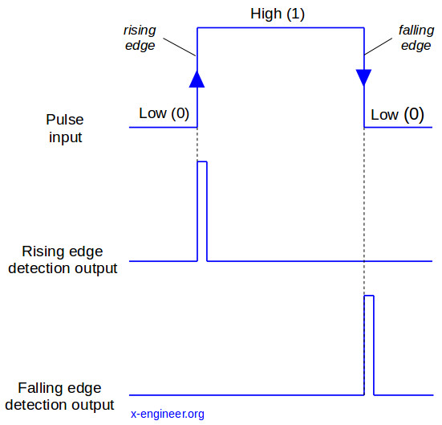

## Falling / Rising

Die Begriffe Rising und Falling sind eigentlich sehr selbsterklärend. Wenn ein Schaltkreis von High auf Low geht nennt man diese Aktion "Falling" und wenn ein Schaltkries von Low auf High geht nennt man es "Rising". [1,3]

> Eine Flankenauswertung bedeutet also, eine Signalveränderung zu erfassen. Es gibt aber zwei Möglichkeiten der Signalveränderung. Wenn man das Beispiel mit dem Paketaufkleber nimmt, dann muss man folgendes feststellen. Wenn das Paket an der Lichtschranke ankommt, ändert sich das Signal von 0 auf 1. Beim Verlassen der Lichtschranke, ändert sich das Signal von 1 auf 0. Beide Signalveränderungen können in einer Steuerung genutzt werden. Beispielsweise könnte man an der Förderbandanlage mit dem Paketaufkleber programmieren, dass nachdem das Paket die Lichtschranke wieder verlassen hat, das Signal also von 1 auf 0 gefallen ist, ein Zylinder bewegt wird, um das Paket auf ein anderes Förderband zu schieben.
>
> Für den Einsatz einer Flankenauswertung gibt es also viele Möglichkeiten. Signalveränderungen von 0 auf 1 oder von 1 auf 0 werden unterschiedlich erfasst und verarbeitet. Diese sind:
>
> - **Positive Flanke:** Erfassung einer Signalveränderung von 0 auf 1. Wird auch häufig "steigende Flanke" genannt, da hier eine Signalveränderung von 0 auf 1, also steigende Veränderung, erfasst wird.
> - **Negative Flanke:** Erfassung einer Signalveränderungen von 1 auf 0. Wird auch "fallende Flanke" genannt, weil hier eine Signalveränderung von 1 auf 0, also fallende Veränderung, erfasst wird.[2]

## Quellen

[1] : "Rising and Falling Edge" [online](https://www.sciencedirect.com/topics/computer-science/rising-clock-edge) | zuletzt besucht 06.11.2019

[2] : "Flankenauswertung" [online](https://www.sps-lehrgang.de/flankenauswertung/) | zuletzt besucht 01.12.2019 

[3] : "Rising / Falling" [online ](https://x-engineer.org/wp-content/uploads/2017/07/Signal-edge-detection.jpg?f24857&f24857) | zuletzt besucht 19.01.2020