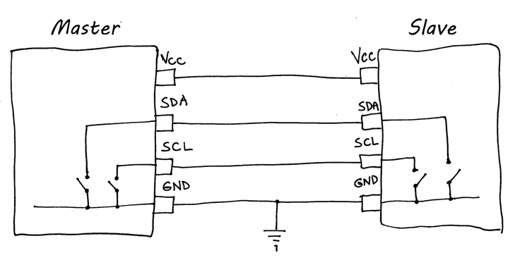

## SPI und I2C

### Allgemeines

SPI und I2C sind beides Zweidrahtbussysteme, der genaue Unterschied zwischen den Beiden werde ich in den nächsten paar Kapiteln erleuchten.

### SPI [1,2]

Fangen wir mit SPI an.

* SPI steht für (Serial Peripheral Interface). 

* wurde für hohe Geschwindigkeit entwickelt (Datenaustausch)
* meist in PCBs, weil die länge limitiert ist
* Durch SPI können beliebig viele ICs miteinander Kommunizieren

Bei diesem System gibt es 2 Leitungen für den Datenaustausch und eine weitere für den Takt, an diesen ist immer jeder Teilnehmer angeschlossen. Des Weiteren gibt es eine weitere Line mit den namen "Slave-Select" oder "Chip-Select". 

* SDO (Serial Data Out) --> MOSI (Master in Slave In)
* SDI (Serial Data In) --> MISO (Master In Slave Out)
* SCLK (Serial Clock, Takt) [1]

Anwendungen:

* Wandler
* Speicher
* Real Time Clocks

### I2C[1,2]

Anderes als beim SPI benutzt I2C nur 2 Signal Lines. Des gibt keinen Slave select oder Konsorten. 

* SDA (Serial Data)
* SCL (Serial Clock)

I2C besitzt 7 Bit Slave Adressen, jeder verbundenen Gerät besitzt eine eigene Adresse. Einige Bits sind für bestimmte Funktionalitäten vor definiert. Theoretisch besitzt I2C 128 mögliche Geräte. I2C besitzt auch eine Maximale Länge, welche 1 Meter bei 100 kbaud und 10 Meter bei 10 kbaud und eine maximal Geschwindigkeit von 100kHz ab. 

Arbeiter nach dem Master Slave Prinzip.

### Vergleich [2]

| SPI                      | I2C                               |
| ------------------------ | --------------------------------- |
| besitzt mehrere Slaves   | besitzt mehrere Slaves und Master |
| 3 bis 4 Kabel            | 2 Kabel                           |
| schneller Datenaustausch | langsamer Datenaustausch          |
| Benötigt weniger Strom   | Benötigt mehr Strom               |
| kein Acknowledgment Bit  | Acknowledgment Bit                |

## Quellen

[1] "SPI and I2C Protocols" [online](https://www.byteparadigm.com/applications/introduction-to-i2c-and-spi-protocols/) | zuletzt besucht 20.01.2020

[2] "Diffrence between SPI and I2C" [online](https://aticleworld.com/difference-between-i2c-and-spi/) | zuletzt besucht 21.01.2020