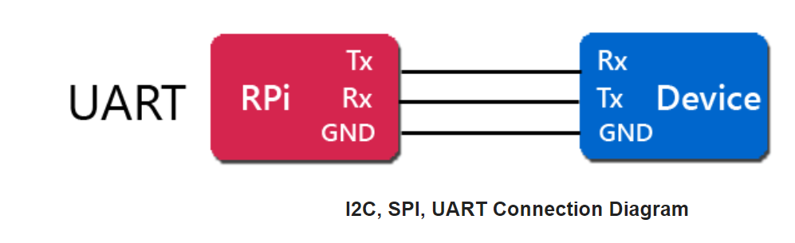

# UART

## Allgemein

UART steht für **U**niversal **A**synchronous **R**eceiver **T**ransmitter. UART ist eine Hardware-Implementierung, die bidirektionale, asynchrone, serielle Kommunikation unterstützt. Es werden zwei Datenleitungen benötigt - eine zum Senden und eine zum Empfangen. Die Sendeleitung eines Geräts ist mit der Empfangsleitung des zweiten Geräts verbunden und umgekehrt zur Übertragung in beide Richtungen. [1,2]

UART kann nur zwischen 2 Komponenten verbunden werden. Dieses BUS-System besitzt folgende Möglichkeiten:

* Simplex: Datenaustausch in eine Richtung
* Half Duplex: Datenaustausch in beide Richtungen aber nicht Synchron
* Full Duplex: gleichzeitiger Datenaustausch in beide Richtungen

Besitzt eine default BAUD-Rate von 115,200. UART ist eines der ältesten BUS-Systeme. Die Geschwindigkeit von UART ist die langsamste zwischen den BUS-Systemen. Des Weiteren kann UART nur mti einer Komponente kommunizieren. [1]

## Quellen

[1] "Raspberry Pi  I2C  /  SPI  /  UART  Communications" [online](https://www.mbtechworks.com/hardware/raspberry-pi-UART-SPI-I2C.html) | zuletzt besucht 26.05.2020

[2] "UART Definition" [online](UART) | zuletzt besucht 26.05.2020