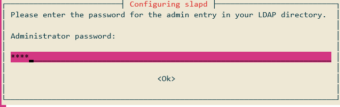
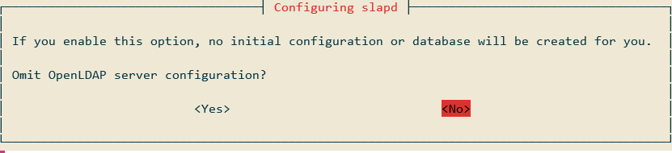
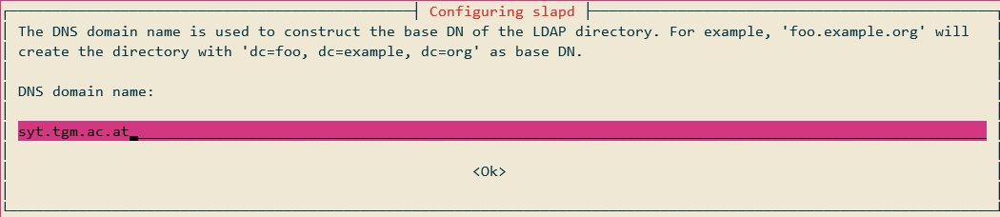
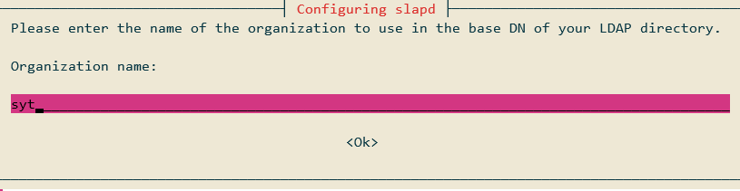
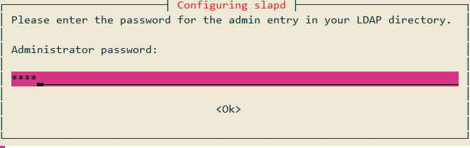

## LDAP Aufsetzen[1,2,3]

### Notwendige Packages installieren

Um einen LDAP-Server installieren zu können braucht man ein bestimmtes Packages, dieses kann man mit folgenden Befehl installieren. Des Weiteren wird bei der Installation dieses Paktes den Benutzer gefragt ein Admin-Passwort zusetzen.

```bash
sudo apt install slapd ldap-utils
```



### SLAPD Konfigurieren

Nun kommen wir zum letzten Schritt des Aufsetzens. Die Konfiguration leitet man mit folgendem Befehl ein. 

```bash
sudo dpkg-reconfigure slapd
```









## Quellen

[1] : "SYT GK723 SysInt/Systemmanagement "Verzeichnisdienste" (SABM oder UMAA)" [online](https://elearning.tgm.ac.at/mod/assign/view.php?id=78136) | zuletzt besucht 22.01.2020

[2] : "Client_LDAP_Authentizierungsquelle" [online / pdf](https://elearning.tgm.ac.at/pluginfile.php/140789/mod_assign/introattachment/0/Client_LDAP_Authentifizierungsquelle.pdf?forcedownload=1) | zuletzt besucht 22.01.2020

[3] : "Openldap_Server_Installation" [online / pdf](https://elearning.tgm.ac.at/pluginfile.php/140789/mod_assign/introattachment/0/Openldap_Server_Intallation%20.pdf?forcedownload=1) | zuletzt besucht 22.01.2020