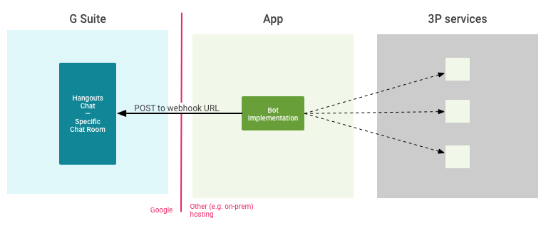

# Webhook

## Allgemein

Mit einem Webhook (auch als Web-Callback oder HTTP-Push-API bezeichnet) kann eine App anderen Anwendungen Echtzeitinformationen bereitstellen. 

Ein Webhook liefert Daten an andere Anwendungen, dh Sie erhalten sofort Daten. Im Gegensatz zu typischen APIs, bei denen Sie sehr häufig nach Daten suchen müssten, um sie in Echtzeit abzurufen. 

Dies macht Webhooks sowohl für Anbieter als auch für Verbraucher viel effizienter. Der einzige Nachteil von Webhooks ist die Schwierigkeit, sie zunächst einzurichten. Webhooks werden manchmal als "Reverse-APIs" bezeichnet, da sie angeben, was einer API-Spezifikation entspricht, und Sie müssen eine API entwerfen, die der Webhook verwenden kann. 

Der Webhook sendet eine HTTP-Anfrage an eine App (normalerweise ein POST), und diese wird dann mit der Interpretation beauftragt.

## Quellen

[1] "What is a webhook" [online](https://sendgrid.com/blog/whats-webhook/) |zuletzt besucht 26.05.2020

[2] "Webhook Image" [online-image](https://developers.google.com/hangouts/chat/images/arch-pat-notifier.png?hl=th) |zuletzt besucht 26.05.2020